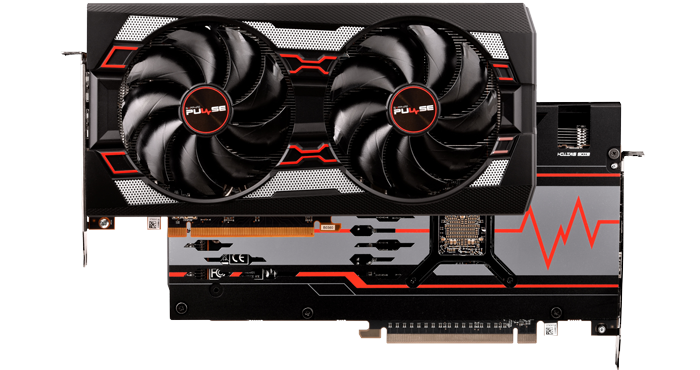

+++
title = "Sapphire AMD Radeon RX 5700 XT 8GB PULSE Graphics Card"

[extra]
image = "image.jpg"
price = "£394.99"
summary = "Sapphire Radeon RX 5700 XT PULSE 8GB GDDR6 PCIe 4.0 Graphics Card, 7nm RDNA, 2560 Streams, 1670MHz GPU, 1925MHz Boost"
+++


Sapphire AMD Radeon RX 5700 XT 8GB PULSE Graphics Card



Brand new Architecture for the new AMD Radeon GPUs


AMD have launched their latest Graphics Cards the Radeon RX 5700 XT Series, the new cards are based on the new RDNA Architecture and now include 8GB of GDDR6 Memory driving the card with a high bandwidth of up to 448GB/s. Game at 1440p performance on today's most demanding titles with ease and with the the new architecture you can run your card faster with lower power consumption than ever before. The Sapphire RX 5700 XT series features new PCI Express 4.0 support with a throughput of 16GT/s and enables two times the bandwidth compared to PCI Express 3.0. By choosing a monitor with FreeSync and combining it with an AMD card of this caliber the results will be a stutter-free, tear-free and artifact-free smooth gaming experience.

{{ graphics_card_statistics(stream_processor="2560", memory_size="8GB", memory_type="GDDR6", base_clock="1670 MHz", boost_clock="1925 MHz") }}


Sapphire AMD Radeon RX 5700 XT Pulse Design



Experience industry leading technologies with a reimagined look


The Radeon RX 5700 XT Pulse GPU performs as good as it looks. Enhance your battle station with a super-cooled AMD GPU that houses 2 large fans to cool your card efficiently and a dark metal look that can look great with any setup. Excellent gaming experiences are created by bending the rules. Harness industry-leading technologies and experience powerful, accelerated gaming customized for you.


Brand New RDNA Architecture with 7nm Process



Reduces latency and provides higher bandwidth


The Radeon RX 5700 XT Series GPUs are powered by the new RDNA architecture, the heart of advanced 7nm technology process. RDNA features up to 40 completely redesigned Compute Units delivering incredible performance and and a multi-level cache hierarchy designed to provide reduced latency, higher bandwidth and lower power. Delivering up to 1.25X higher performance-per-clock and up to 1.5X higher performance-per-watt compared to the previous-generation Graphics Core Next architecture.


Featuring the First AMD GDDR6 PCIe 4.0 Graphics Cards



Super-fast performance for todays demanding titles


Equipped with 8GB of advanced GDDR6 memory to provide high bandwidth of up to 448 GB/s, enabling 1440p performance for today’s most demanding games. Radeon RX 5700 XT series features PCI Express 4.0 support, with a throughput of 16 GT/s and enables two times the bandwidth compared to PCI Express 3.0. Get ready for the next generation of PC gaming.


Superior Gaming Performance with FreeSync Monitors



Smooth Refresh Rate so you can Game at your Best


Pair your new AMD Radeon GPU with a large selection of FreeSync gaming monitors. With such a wide array of monitors equipped with Radeon FreeSync or Radeon FreeSync2 HDR available you can enjoy choosing monitors that are styled and run how you want, but by choosing a monitor with FreeSync and combining it with an AMD card of this caliber the results will be a stutter-free, tear-free and artifact-free smooth gaming experience.
